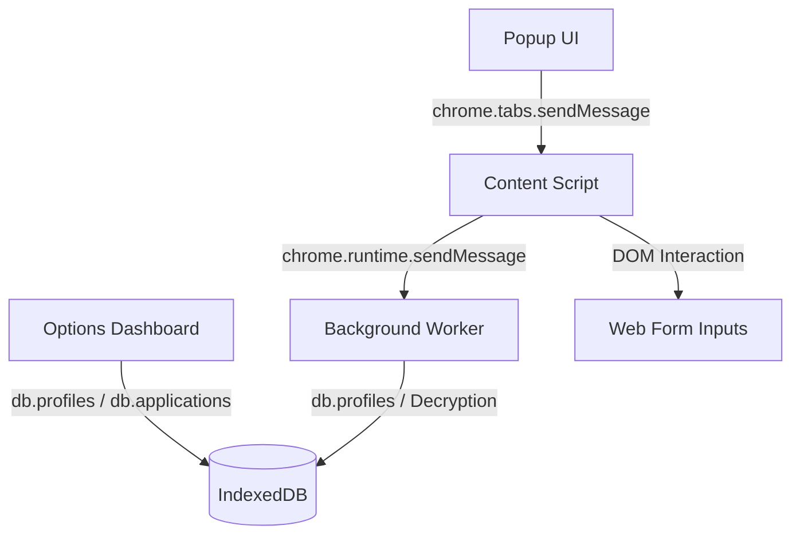

# InternFill — Student-First Internship Autofill Chrome Extension

InternFill is a production-grade Chrome Extension designed to simplify the internship and job application process. It allows students and applicants to store their personal information, education records, experience history, skills, certifications, and social links once, and automatically fill out job applications on any website with a single click.

---

## 🚀 Key Features

1. **Multi-Profile Management**: Create and configure tailored profiles for different roles, such as:
   * **SDE (Full Stack)**
   * **Frontend Developer**
   * **Backend Developer**
   * **DevOps Engineer**
   * **Data Scientist**
2. **Smart Autofill Engine**: 
   * Scans job application forms using a label-to-keyword proximity matching engine.
   * Maps labels, IDs, name attributes, placeholders, and ARIA labels.
   * Bypasses React, Vue, and Angular virtual DOM state interception by injecting native element setters and dispatching standard input events.
   * Custom handlers for major job portals including **Greenhouse**, **Lever**, **Workday**, and **Google Forms**.
3. **Resume Vault**: Upload, store, and manage multiple resume documents (PDF, DOC, DOCX up to 10MB) directly in your browser's IndexedDB, with a simple interface to set a primary/default resume per profile type.
4. **Application Tracker & Dashboard**:
   * Auto-tracks submitted job applications.
   * Full CRUD operations for application status management (Applied, Interview, Rejected, Offer).
   * Visual performance metrics and status distribution charts built with pure CSS.
   * CSV export capability for spreadsheet tracking.
5. **Secure Local-First Architecture**: 
   * Encrypted profile storage in IndexedDB (Dexie) using the standard Web Crypto API (AES-GCM-256).
   * Key generation is persistent, secure, and stored in `chrome.storage.local`.
   * Clear, backup (export JSON), and restore (import JSON) options are available in the Settings tab.
6. **Mock AI Service (Milestone 6)**: Implements structured interfaces and template-driven mock generation for tailored summaries, cover letters, and custom job question answering based on the selected user profile.

---

## 🛠️ Technology Stack

* **UI Layer**: React 19, Lucide React (Icons), Framer Motion (Transitions).
* **Language & Build Tools**: TypeScript, Vite, `@crxjs/vite-plugin` (Manifest V3 support).
* **State Management**: Zustand (Global stores).
* **Database & Storage**: Dexie.js (IndexedDB wrapper), Chrome Storage API.
* **Form Handling**: React Hook Form, Zod v4 (Validation schemas).
* **Testing**: Vitest (Unit and DOM-level integration tests).

---

## 🏗️ System Architecture

InternFill's components communicate asynchronously via the standard Chrome Extension runtime:



### Module Breakdown
* **Content Script** (`src/content/`): Runs in the context of the active web tab. Uses `detector.ts` to rank candidate inputs and `events.ts` / `filler.ts` to safely dispatch event sequences to form controls.
* **Background Worker** (`src/background/`): The extension's service worker. Acts as a secure intermediary for loading database records, performing decryption, and handling routing.
* **Options Page** (`src/options/`): A rich full-page application showing the main dashboard, profile editor tabs, resumes list, tracker table, and system settings.
* **Popup Page** (`src/popup/`): Standard extension action drawer. Allows quick profile toggling, progress tracking, and instant autofill.

---

## ⚙️ Installation & Development

### Prerequisites
* Node.js (v18 or higher)
* Google Chrome or any Chromium-based browser

### Steps to Run Locally

1. **Install Dependencies**:
   ```bash
   npm install
   ```

2. **Run in Development Mode**:
   ```bash
   npm run dev
   ```

3. **Build the Production Bundle**:
   ```bash
   npm run build
   ```
   The compiled extension will be placed in the `dist/` directory.

4. **Load into Google Chrome**:
   * Open Chrome and navigate to `chrome://extensions/`.
   * Toggle **Developer mode** in the top right corner.
   * Click **Load unpacked** in the top left.
   * Select the `dist/` directory generated by the build script.

---

## 🧪 Running Tests

Unit tests are written using **Vitest** and run inside a mock jsdom environment.

Run all tests:
```bash
npm run test
```
The test suite covers:
* Zustand store interactions (CRUD, active profiles).
* Database record decryption and key persistence.
* Field detection heuristics and confidence matching.
* Native value setter simulation and React-compatible event dispatching.
